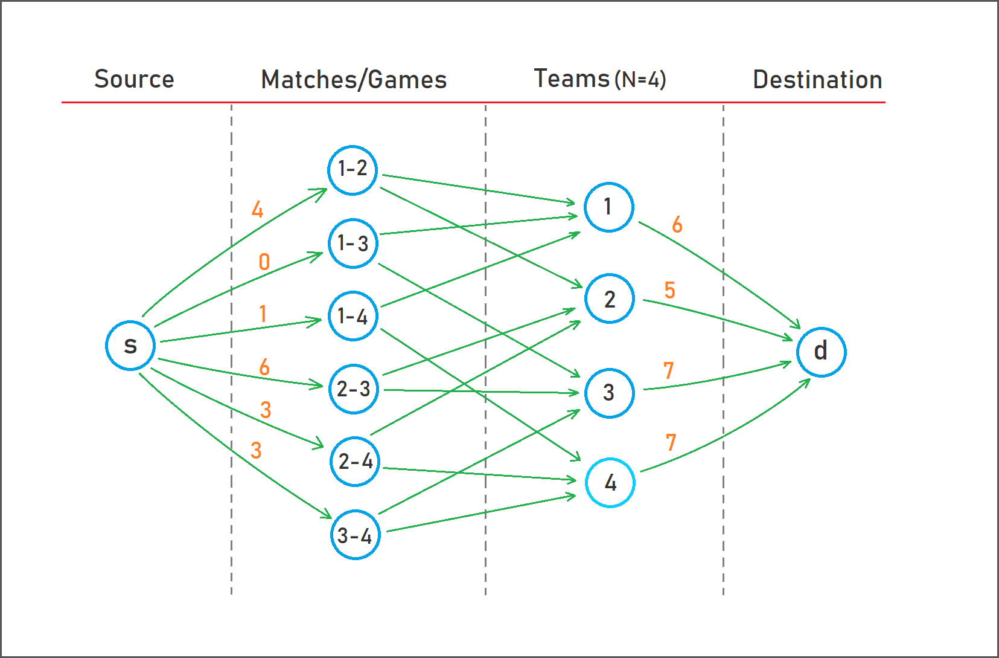

## Project-3 (Analysis of Algorithms-2, ITU)

C++ implementation of *Max-flow* Algorithm (*Ford-Fulkerson*) for a game similar to the famous [Baseball Elimination Problem](https://www.cs.princeton.edu/courses/archive/spr03/cs226/assignments/baseball.html). In this project, the flow network is built with linked lists (somewhat inefficient) and can be improved using matrix-based graph representation for readability.

